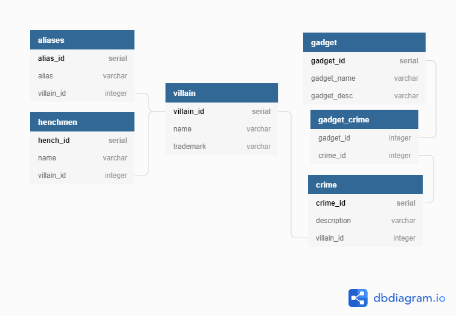

# Known Super Villains

### A relational SQL database of current known super villains and their associates



Database diagram: https://dbdiagram.io/d/5ef536429ea313663b3b1477

## Sources:
- [Batman 60's TV Wiki](https://batman60stv.fandom.com/)
- [DC Database](https://dc.fandom.com/wiki/Batman_(1966_TV_Series))

## Tools Used:

### SQL
- DBDiagram - [dbdiagram.io](https://dbdiagram.io/home)
- PostgreSQL - [postgresql.org](https://postgresql.org)
- pgAdmin - [pgadmin.org](https://pgadmin.org)


## Clone this Repository

For the following instructions use your command line. In Windows, it could be DOS or PowerShell. For Mac and Linux use terminal.

1. Clone this repository. In your command line move to the directory that you would like to use as your base code directory. 
```sh
git clone https://github.com/seanmortimer/cohort4-group.git
```
